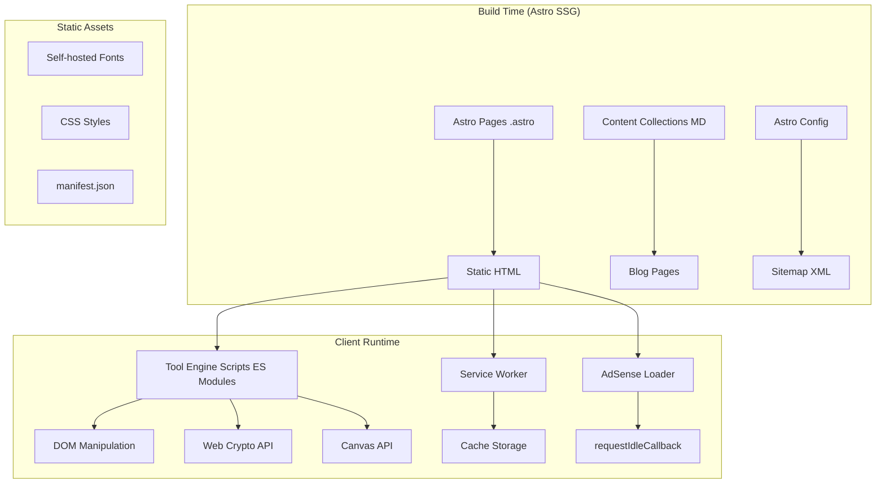
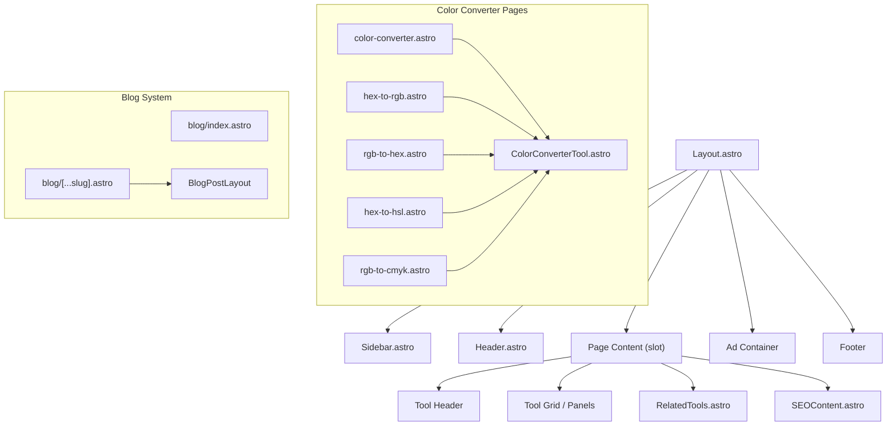
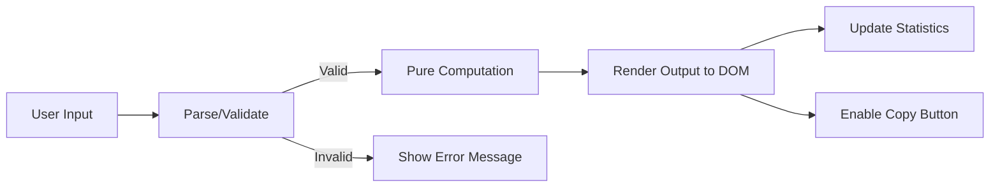
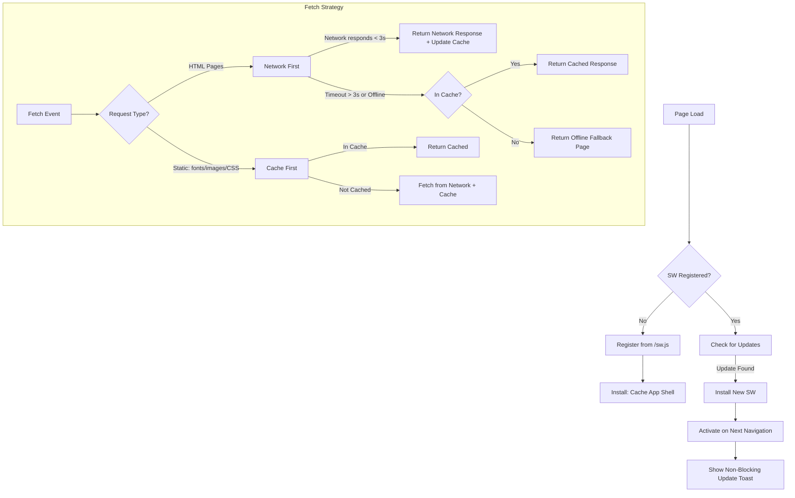
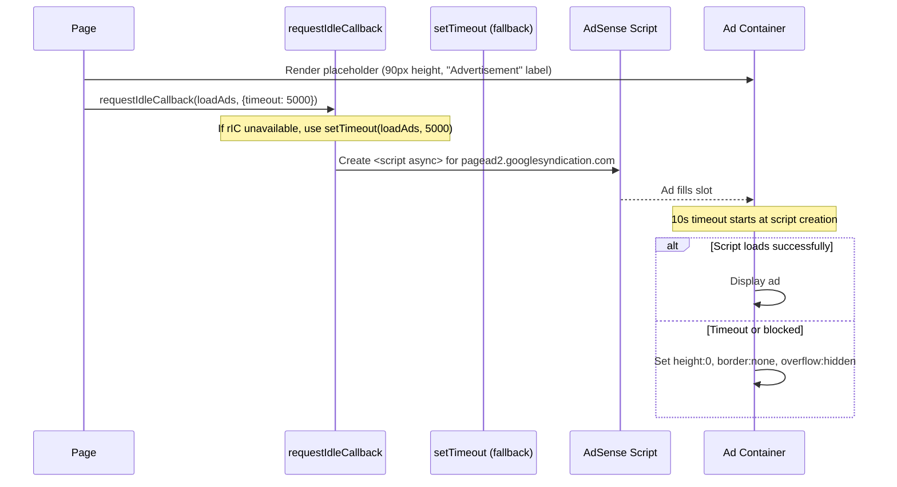
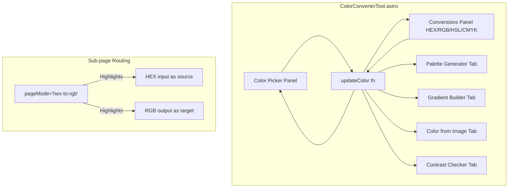

# Design Document: ToolsHub Completion

## Overview

This design covers the completion of the ToolsHub developer tools website — an Astro 6.4.4 static site providing 10 free, 100% client-side developer utilities. The scope includes:

1. **Tool Engine Completion** (Requirements 1–7): Implementing the interactive JavaScript logic for 7 partially-scaffolded tools (URL Encoder, JWT Decoder, Code Minifier, Markdown Editor, Color Converter, Timestamp Converter, Hash Generator)
2. **Content & SEO Systems** (Requirements 8–9): Blog/guide content collection system, SEO sub-pages with long-tail keyword targeting, regex pattern library
3. **Monetisation** (Requirement 10): Non-blocking Google AdSense integration
4. **Performance & PWA** (Requirements 11–12): PageSpeed optimisation (>98 score), service worker with offline support
5. **UX & Accessibility** (Requirements 13–14): Mobile polish, WCAG compliance, cross-tool internal linking

### Design Principles

- **Client-side only**: All tool computations happen in the browser; no server-side processing
- **Progressive enhancement**: Tools work without JavaScript for basic content, enhanced with interactive logic
- **Performance-first**: Scripts load as ES modules, ads load lazily, critical CSS is inlined
- **Accessible by default**: WCAG 2.1 AA contrast, keyboard navigation, screen reader support

## Architecture

### High-Level Architecture



### Technology Stack

| Layer | Technology | Purpose |
|-------|-----------|---------|
| Framework | Astro 6.4.4 | Static site generation |
| Styling | Global CSS + Scoped styles | Dark theme, responsive layout |
| Fonts | @fontsource (Inter, Outfit, Fira Code) | Self-hosted, no external requests |
| Content | Astro Content Collections | Blog/guide Markdown rendering |
| Crypto | Web Crypto API | SHA, HMAC hashing; JWT signing |
| Build | esbuild (via Vite) | CSS/JS minification |
| SEO | @astrojs/sitemap | Auto sitemap generation |
| PWA | Custom Service Worker | Offline caching |

### Script Loading Strategy

All tool engine scripts use `type="module"` via Astro's native `<script>` tag handling (Astro automatically processes inline scripts as ES modules). This ensures:
- Async parsing (non-render-blocking)
- Tree-shaking of unused code per page
- No additional network requests for tool logic (bundled inline)

### Tool Page Pattern

Every tool page follows the established pattern from JSON Formatter:

```
┌──────────────────────────────────────────────────────┐
│ .astro frontmatter: imports, SEO data, accent config │
├──────────────────────────────────────────────────────┤
│ <Layout> wrapper with per-tool accent colors         │
│   <div class="tool-header"> h1 + description         │
│   <div class="tool-grid"> input panel + output panel │
│   <div class="tool-actions"> buttons/controls        │
│   <RelatedTools> 2–4 related tools section           │
│   <SEOContent> how-to + FAQs + schema markup         │
│ </Layout>                                            │
├──────────────────────────────────────────────────────┤
│ <style> scoped CSS for tool-specific UI              │
├──────────────────────────────────────────────────────┤
│ <script> tool engine logic (pure functions + DOM)    │
└──────────────────────────────────────────────────────┘
```

## Components and Interfaces

### Component Hierarchy



### Component Interfaces

#### Layout.astro (existing, extended)
```typescript
interface Props {
  title: string;
  description: string;
  keywords?: string;
  activeTool?: string;
  accentColor?: string;
  accentGlow?: string;
}
```

#### SEOContent.astro (existing)
```typescript
interface Props {
  toolName: string;
  description: string;
  howToUse: string[];
  faqs: { q: string; a: string }[];
}
```

#### RelatedTools.astro (new component)
```typescript
interface Props {
  currentTool: string;  // tool id matching sidebar navigation
}

// Category mapping for related tool suggestions
const TOOL_CATEGORIES: Record<string, string[]> = {
  encoding: ['base64', 'url-encoder-decoder', 'hash-generator'],
  formatting: ['json-formatter', 'code-minifier-beautifier', 'markdown-editor'],
  security: ['jwt-decoder', 'hash-generator'],
  conversion: ['color-converter', 'timestamp', 'base64'],
  development: ['regex-tester', 'json-formatter', 'code-minifier-beautifier'],
};

// Returns 2–4 tools from the same category, excluding currentTool
```

#### ColorConverterTool.astro (existing shared component)
```typescript
interface Props {
  initialColor?: string;   // default: "#14b8a6"
  pageMode?: string;       // e.g. "hex-to-rgb", "rgb-to-hex", "" for main page
}
// pageMode drives which input field is highlighted as "source"
// and which output field is highlighted as "target"
```

#### BlogPostLayout (new)
```typescript
interface Props {
  title: string;
  description: string;
  author: string;
  datePublished: string;
  dateModified?: string;
  topic: 'tutorial' | 'comparison' | 'reference';
  tools: ToolIdentifier[];
}
```

### Tool Engine Data Flow

Each tool follows this data flow pattern:



### Tool Engine Pure Functions

Each tool's client-side logic contains pure computation functions (testable in isolation) and DOM glue code:

| Tool | Pure Functions | Dependencies |
|------|---------------|-------------|
| URL Encoder | `urlEncode(input, mode)`, `urlDecode(input)`, `parseQueryString(url)`, `rebuildUrl(base, params)`, `buildUtmUrl(params)` | None (native APIs) |
| JWT Decoder | `decodeJwt(token)`, `verifyHmacSha256(token, secret)`, `generateJwt(header, payload, secret)`, `checkExpiry(exp)` | Web Crypto API |
| Code Minifier | `minifyCss(input)`, `beautifyCss(input)`, `minifyJs(input)`, `beautifyJs(input)`, `minifyHtml(input)`, `beautifyHtml(input)`, `calcStats(original, output)` | None |
| Markdown Editor | `renderMarkdown(input)`, `insertSyntax(text, selStart, selEnd, type)`, `generateTable(rows, cols)` | None |
| Color Converter | `hexToRgb(hex)`, `rgbToHex(r,g,b)`, `rgbToHsl(r,g,b)`, `hslToRgb(h,s,l)`, `rgbToCmyk(r,g,b)`, `cmykToRgb(c,m,y,k)`, `calculateContrast(fg, bg)`, `generatePalettes(hsl)` | Canvas API (image only) |
| Timestamp | `timestampToDate(ts)`, `dateToTimestamp(dateStr)`, `detectTimestampFormat(input)`, `parseCron(expr)`, `getNextCronRuns(parsed, n)`, `convertTimezones(date, zones)` | None |
| Hash Generator | `computeHash(algo, data)`, `computeHmac(algo, data, key)`, `md5(input)`, `hashFile(arrayBuffer, algo)` | Web Crypto API (SHA); custom MD5 |

### MD5 Implementation

Since Web Crypto API does not support MD5, a pure JavaScript MD5 implementation is included inline. This follows the RFC 1321 algorithm with 64 rounds of bitwise operations on 32-bit words.

### Service Worker Architecture



**Cache structure** (public/sw.js):
- **App Shell cache** (persistent): Layout HTML skeleton, global CSS, font files, favicon
- **Pages cache** (LRU, max 50MB): Individual tool page HTML
- **Static cache** (persistent): Images, manifest.json

**Eviction**: When total cache exceeds 50MB, evict pages from the Pages cache in LRU order, never evicting app shell assets.

### AdSense Loading Strategy



**Placement rules**:
- 1 ad slot in footer area (always present)
- Up to 2 ad slots between SEO content sections (on tool pages)
- All ad slots are outside tool interactive areas
- Fixed container: `min-height: 90px; max-width: 728px; width: 100%`
- CLS = 0 because dimensions are pre-reserved

### Blog Content Collection Schema

```
src/
├── content/
│   ├── config.ts              (collection schema definition)
│   └── blog/
│       ├── what-is-jwt.md
│       ├── jwt-vs-session-tokens.md
│       ├── css-minifier-reduce-page-load.md
│       └── regex-email-validation.md
├── pages/
│   ├── blog/
│   │   ├── index.astro        (listing with date sort + category filters)
│   │   └── [...slug].astro    (dynamic post route with Article schema)
│   └── regex-patterns/
│       └── index.astro        (pattern library with search filter)
```

**Content collection schema** (src/content/config.ts):
```typescript
import { defineCollection, z } from 'astro:content';

const blogCollection = defineCollection({
  type: 'content',
  schema: z.object({
    title: z.string(),
    description: z.string().max(160),
    author: z.string().default('ToolsHub'),
    datePublished: z.date(),
    dateModified: z.date().optional(),
    topic: z.enum(['tutorial', 'comparison', 'reference']),
    tools: z.array(z.enum([
      'json', 'base64', 'url', 'regex', 'jwt',
      'css-js-html', 'markdown', 'color', 'timestamp', 'hash'
    ])).min(1),
    excerpt: z.string().max(160),
  }),
});

export const collections = { blog: blogCollection };
```

**Blog post frontmatter example**:
```yaml
---
title: "What is JWT? A Complete Guide to JSON Web Tokens"
description: "Learn what JWT tokens are, how they work, and how to decode and verify them locally."
author: "ToolsHub"
datePublished: 2024-01-15
topic: tutorial
tools: [jwt]
excerpt: "JSON Web Tokens (JWT) are an open standard for securely transmitting information between parties as a JSON object."
---
```

**Blog post rendering includes**:
- Article schema (JSON-LD) with author, datePublished, dateModified
- Automatic internal link to tool page when `tools` field matches a tool identifier
- Tool-name auto-linking within body content

### Color Converter Component Structure

The `ColorConverterTool.astro` component is shared across the main color-converter page and all sub-pages (hex-to-rgb, rgb-to-hex, hex-to-hsl, rgb-to-cmyk, etc.):



**Sub-page behavior**: The `pageMode` prop (e.g., `"hex-to-rgb"`) triggers CSS highlighting on the source input field and target output field. The component adds a `.conversion-highlight` class and a "SOURCE"/"TARGET" badge via a small script block that reads `data-page-mode`.

**Additional sub-pages to create** (completing requirement 9.1):
- `src/pages/color-converter/hsl-to-hex.astro`
- `src/pages/color-converter/cmyk-to-rgb.astro`

Each sub-page: unique `<title>`, `<meta name="description">`, `<link rel="canonical">`, and keyword-rich H1.

## Data Models

### Color Representation

```typescript
interface RGB { r: number; g: number; b: number; }  // 0-255 integers
interface HSL { h: number; s: number; l: number; }  // h: 0-360, s/l: 0-100
interface CMYK { c: number; m: number; y: number; k: number; }  // 0-100
type HexColor = string;  // #RRGGBB or #RGB

interface ColorState {
  rgb: RGB;
  hsl: HSL;
  cmyk: CMYK;
  hex: HexColor;
}

interface PaletteResult {
  complementary: HexColor;                    // 180° rotation
  analogous: [HexColor, HexColor];            // ±30°
  triadic: [HexColor, HexColor];              // ±120°
  monochromatic: [HexColor, HexColor, HexColor, HexColor, HexColor];  // 5 lightness variations
}

interface ContrastResult {
  ratio: number;                              // 1.0 to 21.0
  aa: { normalText: boolean; largeText: boolean; };
  aaa: { normalText: boolean; largeText: boolean; };
}
```

### JWT Token Structure

```typescript
interface JWTHeader {
  alg: string;
  typ: string;
  [key: string]: unknown;
}

interface JWTPayload {
  exp?: number;
  iat?: number;
  [key: string]: unknown;
}

interface DecodedJWT {
  header: JWTHeader;
  payload: JWTPayload;
  signature: string;
  isExpired: boolean;
  expiryDate?: Date;
}

interface JWTGenerateInput {
  header: string;   // JSON string
  payload: string;  // JSON string
  secret: string;
}
```

### URL Encoder Data

```typescript
interface UTMParams {
  websiteUrl: string;
  source: string;
  medium: string;
  campaign: string;
  term?: string;
  content?: string;
}

interface QueryParam {
  key: string;
  value: string;
}

interface ParsedUrl {
  base: string;       // origin + pathname
  params: QueryParam[];
}

type EncodeMode = 'component' | 'uri';
```

### Timestamp Data

```typescript
interface TimestampBreakdown {
  unix: number;           // seconds
  unixMs: number;         // milliseconds
  utc: string;            // RFC 2822
  local: string;          // local timezone string
  iso8601: string;        // ISO format
  dayOfWeek: string;
  dayOfYear: number;
}

interface CronField {
  type: 'value' | 'range' | 'step' | 'list' | 'wildcard';
  values: number[];
}

interface CronParseResult {
  description: string;    // Human-readable English
  nextRuns: Date[];       // Next 5 execution times
  isValid: boolean;
  error?: string;
}

type TimestampFormat = 'seconds' | 'milliseconds';
```

### Hash Output

```typescript
interface HashResult {
  md5: string;      // 32 hex chars
  sha1: string;     // 40 hex chars
  sha256: string;   // 64 hex chars
  sha512: string;   // 128 hex chars
}

interface HmacResult {
  hmacMd5: string;
  hmacSha1: string;
  hmacSha256: string;
  hmacSha512: string;
}

interface FileChecksumResult {
  fileName: string;
  fileSize: number;
  md5: string;
  sha256: string;
}
```

### Code Minification

```typescript
interface MinifyResult {
  output: string;
  originalSize: number;   // bytes (UTF-8 encoded length)
  outputSize: number;     // bytes
  savings: number;        // percentage, 1 decimal place
}

interface BatchFileResult {
  fileName: string;
  originalSize: number;
  minifiedSize: number;
  savings: number;
  error?: string;
}

type CodeLanguage = 'css' | 'javascript' | 'html';
```

### Markdown Editor

```typescript
type ToolbarAction = 'bold' | 'italic' | 'heading' | 'link' | 'code' | 'blockquote';

interface MarkdownTemplate {
  id: string;
  name: string;
  content: string;
}

type ExportFormat = 'html' | 'md';
```

### Service Worker Cache

```typescript
// Configuration in sw.js
const CACHE_CONFIG = {
  appShellName: 'toolshub-shell-v1',
  pagesName: 'toolshub-pages-v1',
  staticName: 'toolshub-static-v1',
  networkTimeout: 3000,         // ms
  maxCacheSize: 50 * 1024 * 1024, // 50 MB
};

const APP_SHELL_ASSETS: string[] = [
  '/',
  '/offline',
  // CSS and font files (auto-generated at build)
];
```

### Blog Post Frontmatter

```typescript
interface BlogFrontmatter {
  title: string;
  description: string;        // max 160 chars
  author: string;
  datePublished: Date;
  dateModified?: Date;
  topic: 'tutorial' | 'comparison' | 'reference';
  tools: ToolIdentifier[];    // min 1
  excerpt: string;            // max 160 chars
}

type ToolIdentifier = 'json' | 'base64' | 'url' | 'regex' | 'jwt' |
                      'css-js-html' | 'markdown' | 'color' | 'timestamp' | 'hash';

// Mapping tool identifiers to page paths
const TOOL_PATHS: Record<ToolIdentifier, string> = {
  json: '/json-formatter',
  base64: '/base64',
  url: '/url-encoder-decoder',
  regex: '/regex-tester',
  jwt: '/jwt-decoder',
  'css-js-html': '/code-minifier-beautifier',
  markdown: '/markdown-editor',
  color: '/color-converter',
  timestamp: '/timestamp',
  hash: '/hash-generator',
};
```

## Correctness Properties

*A property is a characteristic or behavior that should hold true across all valid executions of a system — essentially, a formal statement about what the system should do. Properties serve as the bridge between human-readable specifications and machine-verifiable correctness guarantees.*

### Property 1: URL Encode/Decode Round-Trip

*For any* arbitrary string, encoding it with `encodeURIComponent` and then decoding with `decodeURIComponent` shall produce the original string. Similarly, encoding with `encodeURI` and decoding with `decodeURI` shall produce the original string.

**Validates: Requirements 1.1, 1.2**

### Property 2: Batch Encode Equals Individual Encode

*For any* list of strings (including empty strings), batch-encoding all lines shall produce the same result as encoding each line individually with `encodeURIComponent` and joining them with newline characters. Empty lines in the input shall remain empty lines in the output.

**Validates: Requirements 1.4**

### Property 3: Query String Parse/Rebuild Round-Trip

*For any* set of key-value pairs where all keys are non-empty strings, constructing a URL with those parameters, parsing it into a table, and rebuilding the URL from the table shall produce a URL whose decoded query parameters are equivalent to the original set (same keys and values, order-independent).

**Validates: Requirements 1.5, 1.6**

### Property 4: UTM Builder Output Validity

*For any* valid UTM parameter set (non-empty website URL, source, medium, and campaign name), the generated URL shall contain `utm_source`, `utm_medium`, and `utm_campaign` query parameters whose decoded values match the original inputs, plus `utm_term` and `utm_content` parameters if and only if those optional fields are non-empty.

**Validates: Requirements 1.7**

### Property 5: UTM Validation Rejects Incomplete Parameters

*For any* UTM parameter set where at least one required field (website URL, source, medium, or campaign name) is empty, the builder shall reject the input and not produce a URL.

**Validates: Requirements 1.8**

### Property 6: JWT Encode/Decode Round-Trip

*For any* valid JSON object as header (containing `alg: "HS256"` and `typ: "JWT"`) and any valid JSON object as payload, generating a signed JWT with a non-empty secret key and then decoding it shall produce header and payload objects deeply equal to the originals.

**Validates: Requirements 2.1, 2.4**

### Property 7: JWT Expiry Detection

*For any* JWT payload containing an `exp` claim as a numeric Unix timestamp (in seconds), the decoded token shall report "Expired" if and only if the `exp` value is strictly less than the current Unix timestamp in seconds at the moment of evaluation.

**Validates: Requirements 2.2**

### Property 8: JWT Signature Verification Correctness

*For any* JWT token generated with secret key K, verifying the signature with the same key K shall return "Valid". Verifying with any different non-empty key K' (where K' ≠ K) shall return "Invalid".

**Validates: Requirements 2.3**

### Property 9: JWT Structure Validation

*For any* string that does not consist of exactly three non-empty segments separated by exactly two dot characters, the JWT decoder shall reject the input with a structural error message.

**Validates: Requirements 2.6**

### Property 10: Code Minification Idempotence

*For any* CSS, JavaScript, or HTML string, applying the corresponding minification function twice shall produce the same output as applying it once: `minify(minify(x)) === minify(x)`.

**Validates: Requirements 3.1, 3.3, 3.5**

### Property 11: Beautify-then-Minify Equivalence

*For any* CSS, JavaScript, or HTML string, beautifying the string and then minifying the result shall produce the same output as minifying the original string directly: `minify(beautify(x)) === minify(x)`.

**Validates: Requirements 3.2, 3.4, 3.6**

### Property 12: Compression Statistics Formula Correctness

*For any* input string and its corresponding minified output, the reported savings percentage shall equal `((originalSize - outputSize) / originalSize × 100)` rounded to one decimal place, where sizes are the UTF-8 byte lengths. If originalSize is 0, savings shall be 0%.

**Validates: Requirements 3.7**

### Property 13: Markdown Rendering Produces Correct HTML Elements

*For any* Markdown input containing CommonMark syntax elements (headings, bold, italic, links, code blocks, lists, blockquotes, horizontal rules, tables), the rendered HTML output shall contain the corresponding semantic HTML elements (`<h1>`–`<h6>`, `<strong>`, `<em>`, `<a>`, `<pre><code>`, `<ul>`/`<ol>`, `<blockquote>`, `<hr>`, `<table>`).

**Validates: Requirements 4.1, 4.8**

### Property 14: Markdown Toolbar Syntax Wrapping

*For any* non-empty text string and any toolbar action (bold, italic, heading, link, code, blockquote), applying the toolbar action to the selected text shall produce output containing the original text wrapped with the correct Markdown syntax delimiters, and the output length shall equal the input length plus the exact number of syntax characters added.

**Validates: Requirements 4.3**

### Property 15: Markdown Table Generation Structure

*For any* row count R (1 ≤ R ≤ 10) and column count C (1 ≤ C ≤ 10), the generated Markdown table string shall contain exactly R + 2 lines (1 header row + 1 separator row + R data rows), and each row shall contain exactly C + 1 pipe characters (C cells separated by pipes with leading and trailing pipes).

**Validates: Requirements 4.7**

### Property 16: Color Format Conversion Round-Trip

*For any* valid RGB color (r, g, b where each is an integer 0–255): converting RGB → HEX → RGB shall produce the original values exactly. Converting RGB → HSL → RGB shall produce values within ±1 of the original. Converting RGB → CMYK → RGB shall produce values within ±1 of the original.

**Validates: Requirements 5.1**

### Property 17: Palette Generation Geometric Correctness

*For any* valid HSL color (h: 0–360, s: 0–100, l: 0–100), the complementary palette color shall have a hue of `(h + 180) mod 360`. The analogous colors shall have hues of `(h + 30) mod 360` and `(h - 30 + 360) mod 360`. The triadic colors shall have hues of `(h + 120) mod 360` and `(h + 240) mod 360`. All monochromatic variations shall share the same hue and saturation as the original, differing only in lightness.

**Validates: Requirements 5.4**

### Property 18: WCAG Contrast Ratio Calculation

*For any* two valid RGB colors used as foreground and background, the calculated contrast ratio shall equal `(L1 + 0.05) / (L2 + 0.05)` (where L1 is the greater relative luminance and L2 the lesser), the ratio shall be in the range [1, 21], and the pass/fail indicators shall correctly apply: AA normal text passes iff ratio ≥ 4.5, AA large text passes iff ratio ≥ 3, AAA normal text passes iff ratio ≥ 7, AAA large text passes iff ratio ≥ 4.5.

**Validates: Requirements 5.5**

### Property 19: CSS Gradient Code Validity

*For any* two valid hex color strings and an angle integer (0–360), the generated CSS code shall be a syntactically valid `linear-gradient()` expression containing both color values and the specified angle in degrees, plus a fallback `background` declaration using the first color.

**Validates: Requirements 5.6**

### Property 20: Timestamp/Date Conversion Round-Trip

*For any* Unix timestamp in seconds (representing a date between 1970-01-01 and 2099-12-31), converting to a Date object and back to a Unix timestamp shall produce the original value exactly. For timestamps in milliseconds, dividing by 1000 and flooring before the round-trip shall produce a value within 1 second of `Math.floor(original / 1000)`.

**Validates: Requirements 6.1, 6.2**

### Property 21: Timezone Offset Correctness

*For any* Unix timestamp and any two of the predefined timezones, the difference in hours between the displayed times for those two timezones shall equal the known UTC offset difference between them (within the applicable DST rules for that date).

**Validates: Requirements 6.4**

### Property 22: Cron Next Runs Are Chronological and Valid

*For any* syntactically valid 5-field cron expression, the returned next 5 execution times shall be in strictly ascending chronological order, each time shall be in the future relative to the reference time, and each time's minute, hour, day-of-month, month, and day-of-week values shall satisfy the constraints defined by the cron fields.

**Validates: Requirements 6.5**

### Property 23: Timestamp Format Auto-Detection

*For any* string of digits, if the string length is 10 or fewer it shall be classified as seconds; if greater than 10 it shall be classified as milliseconds. A seconds-classified value shall be interpreted directly as Unix seconds, and a milliseconds-classified value shall be divided by 1000 for date conversion.

**Validates: Requirements 6.6**

### Property 24: Hash and HMAC Output Format and Determinism

*For any* input string (and for HMAC, any non-empty key string), all hash outputs shall be lowercase hexadecimal strings of exactly the correct length: MD5 = 32 chars, SHA-1 = 40 chars, SHA-256 = 64 chars, SHA-512 = 128 chars. Computing the hash of the same input (and key) twice shall produce identical output.

**Validates: Requirements 7.1, 7.2, 7.4**

### Property 25: Related Tools Category Mapping

*For any* tool ID from the 10 supported tools, the related tools function shall return between 2 and 4 (inclusive) tool IDs that belong to the same functional category as the input tool, and the result shall never include the input tool itself.

**Validates: Requirements 14.1**

## Error Handling

### Tool Engine Error Handling Pattern

All tool engines follow a consistent error handling approach:

| Scenario | Behaviour |
|----------|-----------|
| Empty input | Clear output, show zero stats or placeholder message |
| Invalid input format | Display error in output panel, preserve input content |
| Encoding/decoding failure | Show specific error (e.g., "Invalid percent sequence: %ZZ") |
| JSON parse failure | Show error with message from caught exception |
| File too large | Display warning (hash: 50MB) or reject (minifier: 5MB, color: 10MB) |
| Unsupported file type | Reject with message listing accepted extensions |
| Clipboard API unavailable | Fallback: select text programmatically for manual copy |
| Web Crypto API unavailable | Display message that browser lacks required crypto support |

### Service Worker Error Handling

| Scenario | Behaviour |
|----------|-----------|
| Network timeout (>3s for HTML) | Serve cached version if available |
| Page not in cache + offline | Serve custom `/offline` fallback page |
| Cache storage exceeds 50MB | Evict LRU page entries, retain app shell |
| SW registration failure | Site functions normally without offline support |
| SW update detection failure | Continue with current cached version |

### AdSense Error Handling

| Scenario | Behaviour |
|----------|-----------|
| Script blocked by ad blocker | Collapse container: `height: 0; overflow: hidden; border: none` |
| Network timeout (>10s after initiation) | Same collapse behaviour |
| Script loads but no ad fill | Maintain placeholder or collapse |

### Content System Error Handling

| Scenario | Behaviour |
|----------|-----------|
| Invalid blog frontmatter | Astro build fails with Zod schema validation error (caught at build time) |
| Unknown tool identifier in `tools` field | Post renders without tool link, excluded from tool-filtered views |
| Missing required frontmatter fields | Build-time error; deploy blocked |

## Testing Strategy

### Dual Testing Approach

This project uses both example-based unit tests and property-based tests for comprehensive coverage of the 25 correctness properties and supplementary edge cases.

### Property-Based Testing Configuration

**Library**: [fast-check](https://github.com/dubetc/fast-check) — JavaScript/TypeScript property-based testing framework

**Runner**: Vitest (Vite-native, compatible with Astro's build tooling)

**Configuration**: Minimum 100 iterations per property test

**Tag format**: Each property test includes a comment:
```typescript
// Feature: toolshub-completion, Property {N}: {title}
```

**Applicable to** (pure computation functions extractable from tool scripts):
- URL encoding/decoding and query string manipulation
- JWT encode/decode/verify/generate
- CSS/JS/HTML minification and beautification
- Markdown rendering, syntax insertion, table generation
- Color format conversions, palette generation, contrast calculation
- Timestamp/date conversions, cron parsing
- Hash/HMAC computation and formatting
- Related tools category mapping

### Unit Tests (Example-Based)

Specific scenarios, edge cases, and integration points not suitable for PBT:

- Template selection loads correct known content (Req 4.4)
- Export HTML/MD generates correct file content (Req 4.5, 4.6)
- Empty input produces placeholder/zero state (Req 3.9, 4.2, 7.7)
- Invalid file types rejected with correct message (Req 3.10, 5.8)
- JWT Share URL formats correctly (Req 2.5)
- Blog post with valid tool field includes internal link (Req 8.4)
- Blog index sorts by datePublished descending (Req 8.3)
- Regex pattern library structure (Req 9.2, 9.4)
- Footer contains all 10 tool links (Req 14.4)
- Ad container dimensions match specification (Req 10.2)
- Focus management on sidebar open/close (Req 13.7)

### Integration Tests

Cross-component and build output verification:
- Blog posts render with Article schema JSON-LD
- Sitemap.xml includes blog post URLs
- Color sub-pages have distinct title/description/canonical
- Service worker routing logic (with mocked fetch)
- Regex "Test in RegEx Tester" link navigates with pre-loaded pattern

### Smoke Tests

One-time configuration and performance checks:
- No external font requests in built output
- `compressHTML` produces minified HTML
- Script tags rendered as modules
- Critical path page weight < 200KB
- Ad placeholder displays "Advertisement" text
- Lighthouse mobile score ≥ 98 (CI gate)

### Test File Structure

```
tests/
├── properties/
│   ├── url-encoder.property.test.ts
│   ├── jwt-decoder.property.test.ts
│   ├── code-minifier.property.test.ts
│   ├── markdown-editor.property.test.ts
│   ├── color-converter.property.test.ts
│   ├── timestamp-converter.property.test.ts
│   ├── hash-generator.property.test.ts
│   └── related-tools.property.test.ts
├── unit/
│   ├── url-encoder.test.ts
│   ├── jwt-decoder.test.ts
│   ├── code-minifier.test.ts
│   ├── markdown-editor.test.ts
│   ├── color-converter.test.ts
│   ├── timestamp-converter.test.ts
│   ├── hash-generator.test.ts
│   └── blog-system.test.ts
├── integration/
│   ├── blog-rendering.test.ts
│   ├── seo-pages.test.ts
│   └── service-worker.test.ts
└── setup.ts
```

### Test Runner Configuration

- **Vitest** for unit and property tests (native Vite integration with Astro)
- **fast-check** for property-based test generation and shrinking
- **Lighthouse CI** for performance regression testing in CI pipeline
- Tests run with `vitest --run` (single execution, no watch mode)
