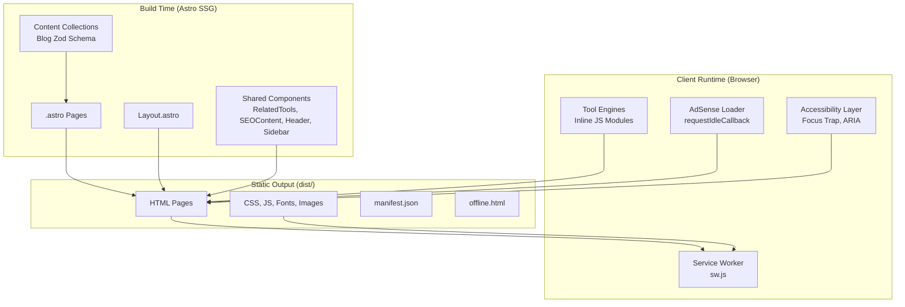
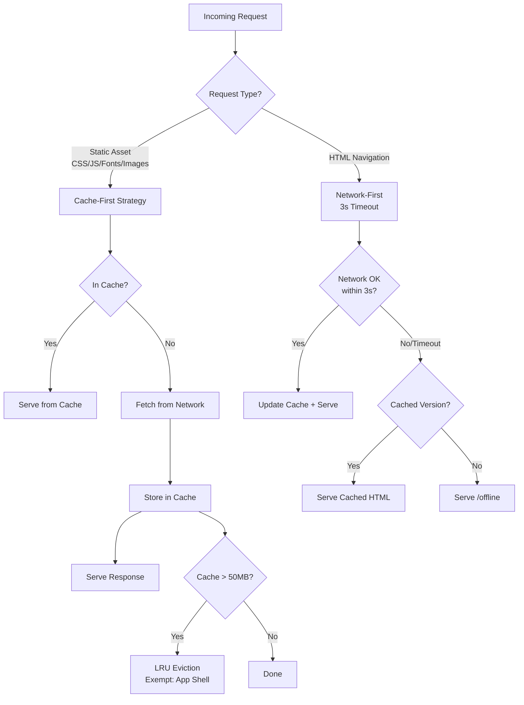

# Design Document: ToolsHub Gap Remediation

## Overview

This design covers the completion of 15 remaining feature gaps in the ToolsHub developer tools static site. The work spans three categories:

1. **Tool Engine Enhancements** (Requirements 1–7): Completing client-side JavaScript logic for URL batch/UTM, JWT sign/verify/generate, HTML minification, Markdown templates/export, Color palettes/gradient/image extraction, Timestamp timezone/cron, and Hash file checksum features.
2. **Infrastructure & Content** (Requirements 8–11, 14): Cross-tool internal linking, service worker rewrite with caching strategies, blog migration to Astro Content Collections, AdSense lazy loading, and SEO content gaps.
3. **Quality & Performance** (Requirements 12, 13, 15): Accessibility polish (focus management, ARIA, touch targets), Color sub-page PageMode activation, and performance hardening (font-display, CLS, Lighthouse scores).

All tool logic runs **client-side in the browser**. The site is built with Astro 6.4.4 as a static site generator. No server-side runtime exists beyond build time. The architecture uses `.astro` components with inline `<script>` blocks for tool interactivity.

## Architecture

### High-Level System Diagram



### Caching Strategy Diagram



## Components and Interfaces

### 1. Tool Engine Modules

Each tool page contains an inline `<script type="module">` block. The gap remediation adds the following functions/modules:

| Tool Page | New Functions | Description |
|-----------|--------------|-------------|
| `url-encoder-decoder.astro` | `batchEncode()`, `batchDecode()`, `parseQueryParams()`, `rebuildUrl()`, `generateUtm()` | Batch processing, query parsing, UTM generation |
| `jwt-decoder.astro` | `verifySignature()`, `generateToken()`, `shareUrl()` | HMAC-SHA256 verify/sign via Web Crypto API |
| `code-minifier-beautifier.astro` | `minifyHtml()`, `beautifyHtml()`, `processBatchFiles()` | HTML mode engine, batch file processing |
| `markdown-editor.astro` | `loadTemplate()`, `generateTable()`, `exportHtml()`, `exportMd()` | Template system, table insertion, file export |
| `color-converter.astro` + component | `generatePalettes()`, `checkContrast()`, `buildGradient()`, `extractFromImage()` | Palette math, WCAG ratio, gradient CSS, canvas pixel reading |
| `timestamp.astro` | `convertTimezones()`, `parseCron()`, `getNextCronRuns()` | Intl.DateTimeFormat for TZ, cron parser with simulation |
| `hash-generator.astro` | `computeFileChecksum()`, `copyHash()` | ArrayBuffer hashing via Web Crypto (SHA-256) + JS MD5 |

### 2. RelatedTools Component

**File:** `src/components/RelatedTools.astro`

```typescript
interface Props {
  currentTool: string; // Tool identifier (e.g., "json-formatter")
}
```

**Category Map:**
- `encoding`: ["base64", "url-encoder-decoder"]
- `formatting`: ["json-formatter", "code-minifier-beautifier", "markdown-editor"]
- `security`: ["jwt-decoder", "hash-generator"]
- `conversion`: ["color-converter", "timestamp"]
- `development`: ["regex-tester"]

**Logic:** Find current tool's category → select 2–4 other tools from same category → if fewer than 2 available, supplement from adjacent categories → render cards with tool name, link, and icon.

### 3. Service Worker (`public/sw.js`)

**Strategies:**
- **Cache-first** for: `*.css`, `*.js`, fonts (`*.woff2`), images (`*.svg`, `*.png`, `*.ico`)
- **Network-first (3s timeout)** for: HTML navigation requests
- **Precache on install**: All 10 tool pages + `/offline` + app shell assets

**LRU Eviction:**
- Threshold: 50 MB total cache storage
- Exempt entries: HTML pages (app shell), critical CSS, fonts, favicon
- Eviction order: Least recently accessed entries removed first
- Triggered after each successful cache write

**Update Flow:**
- On `controllerchange` event → inject toast DOM → auto-dismiss after 8s or on click

### 4. AdSense Loader

**File:** Inline script in `Layout.astro`

```
Load sequence:
1. Page loads → FCP occurs
2. requestIdleCallback fires (or setTimeout 5s fallback)
3. Create <script> element for AdSense library
4. On script load → initialize ad slots
5. After 10s timeout with no fill → collapse container to 0px height
```

**Ad Container Spec:**
- Fixed height: 90px, width: 100%, max-width: 728px
- Position: Below tool content, above footer (never between tool inputs/outputs)
- Maximum: 3 per page

### 5. Content Collections (Blog)

**Schema (`src/content/config.ts`):**

```typescript
import { defineCollection, z } from 'astro:content';

const blog = defineCollection({
  type: 'content',
  schema: z.object({
    title: z.string().max(100),
    description: z.string().max(160),
    author: z.string(),
    datePublished: z.date(),
    dateModified: z.date(),
    topic: z.enum(['tutorial', 'comparison', 'reference']),
    tools: z.array(z.enum([
      'json-formatter', 'base64', 'regex-tester', 'jwt-decoder',
      'hash-generator', 'url-encoder-decoder', 'timestamp',
      'markdown-editor', 'color-converter', 'code-minifier-beautifier'
    ])),
    excerpt: z.string().max(200),
  }),
});

export const collections = { blog };
```

### 6. Offline Fallback Page

**File:** `src/pages/offline.astro`

Renders a static page with:
- Offline status message
- Links to all 10 tool pages (served from precache)
- No JavaScript dependencies (server-rendered HTML only)

### 7. Color Sub-Page PageMode Activation

The `ColorConverterTool.astro` component already accepts a `pageMode` prop. The client-side script needs to:
1. Read `data-page-mode` attribute on mount
2. Parse source/target format from the string (e.g., `"hex-to-rgb"` → source: `hex`, target: `rgb`)
3. Set focus on the source input field
4. Add `.conversion-highlight` CSS class to the target output `.form-control`
5. If pageMode is empty, default to HEX active with no highlights

## Data Models

### Blog Post Frontmatter

```yaml
---
title: "How to Write Regex for Email Validation"
description: "Learn step-by-step how to build and test a regex..."
author: "ToolsHub"
datePublished: 2024-01-15
dateModified: 2024-03-20
topic: tutorial
tools: ["regex-tester"]
excerpt: "A complete guide to building robust email validation regex..."
---
```

### Service Worker Cache Entry Metadata

```typescript
interface CacheEntry {
  url: string;
  lastAccessed: number;  // timestamp for LRU ordering
  size: number;          // response size in bytes
  isAppShell: boolean;   // exempt from eviction
}
```

### Tool Category Map (for RelatedTools)

```typescript
const TOOL_CATEGORIES: Record<string, string[]> = {
  encoding: ["base64", "url-encoder-decoder"],
  formatting: ["json-formatter", "code-minifier-beautifier", "markdown-editor"],
  security: ["jwt-decoder", "hash-generator"],
  conversion: ["color-converter", "timestamp"],
  development: ["regex-tester"],
};
```

### UTM Builder Form Data

```typescript
interface UtmParams {
  websiteUrl: string;     // Required - base URL
  source: string;         // Required - utm_source
  medium: string;         // Required - utm_medium
  campaign: string;       // Required - utm_campaign
  term?: string;          // Optional - utm_term
  content?: string;       // Optional - utm_content
}
```

### Cron Expression Model

```typescript
interface CronField {
  type: 'wildcard' | 'value' | 'range' | 'list' | 'step';
  values: number[];       // Resolved numeric values
  raw: string;            // Original field string
}

interface ParsedCron {
  minute: CronField;      // 0-59
  hour: CronField;        // 0-23
  dayOfMonth: CronField;  // 1-31
  month: CronField;       // 1-12
  dayOfWeek: CronField;   // 0-6
  description: string;    // Human-readable English
  nextRuns: Date[];       // Next 5 execution times
}
```

## Correctness Properties

*A property is a characteristic or behavior that should hold true across all valid executions of a system—essentially, a formal statement about what the system should do. Properties serve as the bridge between human-readable specifications and machine-verifiable correctness guarantees.*

### Property 1: Batch Encode Preserves Line Structure

*For any* array of strings (including empty strings and strings with special URL characters), batch encoding each non-empty line with `encodeURIComponent` SHALL produce an output array of the same length where empty/whitespace-only lines remain as empty output lines and each non-empty line is independently percent-encoded.

**Validates: Requirements 1.1**

### Property 2: Batch Decode Round-Trip with Error Recovery

*For any* array of strings where some are valid percent-encoded sequences and some are not, batch decoding SHALL successfully decode all valid lines (recovering the original string) and prefix invalid lines with an error indicator containing the original input, without halting processing of remaining lines.

**Validates: Requirements 1.2**

### Property 3: URL Query String Parse/Rebuild Round-Trip

*For any* valid URL with query parameters, parsing the URL into key-value pairs and then rebuilding the URL from those pairs (omitting rows with empty keys) SHALL produce a URL with an equivalent set of query parameters to the original.

**Validates: Requirements 1.3, 1.5**

### Property 4: UTM URL Generation Correctness

*For any* valid website URL and non-empty values for source, medium, and campaign name (including strings with special characters), the generated UTM URL SHALL contain all required parameters (utm_source, utm_medium, utm_campaign) in that order, properly percent-encoded, appended to the website URL.

**Validates: Requirements 1.6**

### Property 5: JWT Sign/Verify Round-Trip

*For any* valid JSON header object, valid JSON payload object, and secret key of 1–256 characters, generating an HS256-signed JWT and then verifying it with the same secret SHALL produce a "Valid Signature" result, and verifying with a different secret SHALL produce an "Invalid Signature" result.

**Validates: Requirements 2.1, 2.3**

### Property 6: HTML Minification Invariants

*For any* HTML string, minifying it SHALL produce output containing no HTML comment sequences (`<!--` ... `-->`), no consecutive whitespace characters (only single spaces), and no whitespace between adjacent `>` and `<` characters. The compression statistics SHALL correctly report ((original_bytes - output_bytes) / original_bytes × 100) rounded to 1 decimal place, displaying 0% when original is 0 bytes.

**Validates: Requirements 3.1, 3.3**

### Property 7: HTML Beautify Indentation Consistency

*For any* HTML string, beautifying it SHALL produce output where each opening tag is on its own line, each closing tag is on its own line, indentation increases by exactly 2 spaces per nesting level, and void elements (img, input, br, hr, meta, link) and self-closing tags do not increase indent depth for subsequent elements.

**Validates: Requirements 3.2**

### Property 8: Batch File Minification Per-File Correctness

*For any* set of files with extensions .css, .js, or .html (each ≤5 MB, up to 50 files), batch processing SHALL minify each file using the language detected from its extension, and each per-file result SHALL display the correct filename, original size, minified size, and percentage savings calculated as ((original - minified) / original × 100) rounded to 1 decimal place.

**Validates: Requirements 3.4**

### Property 9: Markdown Table Generator Structure

*For any* row count (1–10) and column count (1–10), the generated Markdown table SHALL contain exactly 1 header row with the specified number of columns, 1 separator row with dashes and pipes, and exactly the specified number of data rows, all with consistent column counts matching the specified value.

**Validates: Requirements 4.2**

### Property 10: Markdown Export HTML Document Integrity

*For any* non-empty Markdown string, exporting to HTML SHALL produce a complete HTML document containing a DOCTYPE declaration, `<html>`, `<head>` with a `<style>` block, and `<body>` containing the rendered Markdown content (where Markdown headings, paragraphs, and code blocks are transformed to their HTML equivalents).

**Validates: Requirements 4.3**

### Property 11: Color Palette Generation Mathematical Correctness

*For any* valid hex color, palette generation SHALL produce: a complementary color with hue rotated exactly 180°, analogous colors at ±30° hue rotation, triadic colors at 120° intervals, and 5 monochromatic variations of differing lightness — all preserving the saturation of the original color (for complementary, analogous, and triadic) and preserving hue and saturation (for monochromatic).

**Validates: Requirements 5.1**

### Property 12: WCAG Contrast Ratio Calculation

*For any* two valid colors (foreground and background), the computed contrast ratio SHALL equal (L1 + 0.05) / (L2 + 0.05) where L1 is the relative luminance of the lighter color and L2 is the relative luminance of the darker color, and the pass/fail indicators SHALL correctly apply thresholds: AA normal ≥ 4.5:1, AA large ≥ 3:1, AAA normal ≥ 7:1, AAA large ≥ 4.5:1.

**Validates: Requirements 5.2**

### Property 13: Gradient CSS Output Format

*For any* two valid hex colors and angle value (0–360), the gradient builder SHALL output CSS containing a `background-color` fallback declaration with the first color, followed by a `background: linear-gradient({angle}deg, {color1}, {color2})` declaration.

**Validates: Requirements 5.3**

### Property 14: Timestamp Timezone Conversion

*For any* valid numeric timestamp (up to 13 digits), the converter SHALL interpret ≤10 digits as seconds-since-epoch and >10 digits as milliseconds-since-epoch, and SHALL display the corresponding date/time formatted as medium date and short time for all 6 predefined timezones (UTC, America/New_York, America/Los_Angeles, Europe/Paris, Asia/Kolkata, Asia/Tokyo).

**Validates: Requirements 6.1, 6.2**

### Property 15: Cron Expression Parsing and Execution Scheduling

*For any* valid 5-field cron expression (supporting wildcards, step values, comma lists, and ranges within allowed field ranges), the parser SHALL produce a human-readable English description and compute up to 5 next execution times by simulating minute-by-minute increments, where each computed time satisfies all 5 cron field constraints.

**Validates: Requirements 6.4**

### Property 16: File Checksum Determinism

*For any* byte sequence (ArrayBuffer), computing MD5 SHALL produce a 32-character lowercase hexadecimal string and computing SHA-256 SHALL produce a 64-character lowercase hexadecimal string, and repeating the computation on identical input SHALL produce identical output.

**Validates: Requirements 7.1**

### Property 17: Related Tools Category Correctness

*For any* tool identifier from the set of 10 tools, the RelatedTools component SHALL render 2–4 related tool cards where none link to the current tool's page, and where each suggested tool belongs to the same category as the current tool (supplemented from other categories only when the same-category pool contains fewer than 2 other tools).

**Validates: Requirements 8.1, 8.5**

### Property 18: LRU Cache Eviction Ordering

*For any* set of cache entries with varying last-access timestamps where total size exceeds 50 MB, LRU eviction SHALL remove entries in ascending last-access-time order (least recently used first) until total size falls below 50 MB, while retaining all entries marked as app-shell assets regardless of their access time.

**Validates: Requirements 9.4**

### Property 19: Blog Post Chronological Ordering

*For any* set of blog posts with distinct datePublished values, the blog index page SHALL list them in strictly descending datePublished order (newest first).

**Validates: Requirements 10.2**

### Property 20: Blog Auto-Link Tool Names

*For any* blog post body text containing tool names from the post's `tools` frontmatter array, the rendered HTML SHALL wrap the first occurrence of each matching tool name in an `<a>` element linking to the correct tool page path, without modifying subsequent occurrences or non-matching text.

**Validates: Requirements 10.4**

### Property 21: Blog Post JSON-LD Schema Correctness

*For any* blog post with valid frontmatter, the rendered page SHALL include Article schema JSON-LD where `author` matches frontmatter author, `datePublished` matches frontmatter datePublished in ISO 8601 format, and `dateModified` matches frontmatter dateModified in ISO 8601 format.

**Validates: Requirements 10.6**

### Property 22: PageMode Focus and Highlight Activation

*For any* valid pageMode string in format `"{source}-to-{target}"` where source and target are one of hex, rgb, hsl, cmyk, the ColorConverterTool SHALL set focus on the source format input field and apply the `.conversion-highlight` CSS class to the target format output container.

**Validates: Requirements 13.2, 13.3**

### Property 23: Regex Pattern Library Link Round-Trip

*For any* regex pattern string in the pattern library, the "Test in RegEx Tester" link SHALL have href `/regex-tester?pattern={URI-encoded pattern}`, and when the RegEx Tester page loads with that query parameter, it SHALL URI-decode the value and populate the regex input field with the original pattern string.

**Validates: Requirements 14.2, 14.3**

### Property 24: Inline Validation Error Association

*For any* tool input field with defined validation rules, when the field contains an invalid value, the tool page SHALL display an inline error message element whose `id` is referenced by the input's `aria-describedby` attribute, and SHALL remove the error message when the input value becomes valid.

**Validates: Requirements 12.7**

## Error Handling

### Tool Engine Error Patterns

All tool engines follow a consistent error handling pattern:

1. **Input Validation Errors**: Display inline error messages adjacent to the invalid input. Use `aria-describedby` to associate the error with the input. Remove error when input becomes valid.
2. **Processing Errors** (e.g., file read failures, canvas errors): Display a styled error notification within the tool's output area. Never use `alert()`.
3. **Clipboard Failures**: Silently fail — leave button text unchanged. Do not display error messages for clipboard operations.
4. **Batch Processing Errors**: Per-item error handling. Invalid items display individual error messages. Valid items in the same batch continue processing.
5. **Timeout/Exhaustion**: Display informational messages (e.g., cron simulation "no future schedules found") without treating them as errors.

### Service Worker Error Handling

- **Network timeout (3s)**: Fall back to cached HTML version
- **No cache + no network**: Serve `/offline` fallback page
- **Cache storage quota exceeded**: Trigger LRU eviction before retrying cache write
- **Script errors in SW**: Catch all errors in fetch handler, fall through to default browser behavior

### AdSense Error Handling

- **Script load failure**: Collapse ad container to 0px (no visible error)
- **No ad fill after 10s**: Collapse container, no transition, no border, no background
- **requestIdleCallback unavailable**: Fall back to `setTimeout(fn, 5000)`

## Testing Strategy

### Unit Tests (Example-Based)

Focus on:
- Template selection replacing input content (Requirement 4.1)
- Clipboard interactions with mocked APIs (Requirements 2.6, 2.7, 7.4, 7.6)
- Mobile drawer focus trap behavior (Requirements 12.3, 12.4, 12.5)
- AdSense loading via requestIdleCallback (Requirement 11.1)
- Ad container collapse on failure (Requirement 11.3)
- Default PageMode behavior when no prop (Requirement 13.4)
- Blog category filter client-side behavior (Requirements 10.3, 14.5)

### Property-Based Tests

**Library:** [fast-check](https://github.com/dubzzz/fast-check) (JavaScript/TypeScript PBT library)

**Configuration:**
- Minimum 100 iterations per property test
- Each test tagged with: `Feature: toolshub-gap-remediation, Property {N}: {title}`

Properties 1–24 as defined in the Correctness Properties section above SHALL each be implemented as a single property-based test with generated inputs covering:
- Unicode strings, empty strings, whitespace-only strings
- Valid and invalid URLs, percent-encoded sequences
- Random JSON objects for JWT payloads
- HTML strings with varying nesting, comments, whitespace
- Random hex colors across the full color space
- Timestamps across valid epoch range
- Cron expressions with all supported syntax
- Arbitrary byte arrays for hash computation

### Integration Tests

Focus on:
- Service worker caching strategies with mocked fetch/cache APIs (Requirements 9.1–9.3, 9.5)
- Canvas-based image color extraction (Requirement 5.4)
- Lighthouse performance audits (Requirement 15.5)
- Blog Content Collection build validation (Requirement 10.1)

### Smoke Tests

Focus on:
- Footer links to all 10 tools (Requirement 8.4)
- `aria-live="polite"` on output areas (Requirement 12.2)
- Focus indicator CSS (Requirement 12.1)
- Touch target minimum 44×44px (Requirement 12.6)
- No `alert()` in tool scripts (Requirement 12.8)
- Font-display: swap (Requirement 15.1)
- img width/height attributes (Requirement 15.2)
- Minified HTML output (Requirement 15.3)
- type="module" on tool scripts (Requirement 15.4)
- Blog article existence checks (Requirements 10.7, 14.1)
- Color sub-page pageMode prop passing (Requirement 13.1)
- Ad container DOM positioning (Requirements 11.2, 11.5, 11.6)
