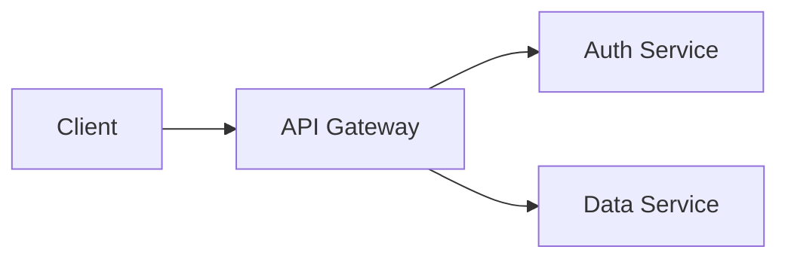

# Markdown for Developers: Write Better Documentation

Good documentation separates professional projects from abandoned repos. Markdown is the universal language of developer documentation — it powers GitHub READMEs, technical blogs, API docs, wikis, and note-taking apps. Yet many developers only scratch the surface of what Markdown can do. This guide covers everything from basics to advanced patterns that will level up your documentation game.

## Why Markdown Matters for Developers

- **Universal support:** GitHub, GitLab, Bitbucket, Stack Overflow, Notion, Slack, Discord — all render Markdown
- **Version control friendly:** Plain text diffs cleanly in Git, unlike Word docs or PDFs
- **Fast to write:** No clicking through formatting menus — your hands stay on the keyboard
- **Portable:** Convert to HTML, PDF, DOCX, slides, or static sites with tools like Pandoc
- **Readable raw:** Even without rendering, Markdown source is human-readable

## Basic Markdown Syntax

### Headings

```markdown
# Heading 1
## Heading 2
### Heading 3
#### Heading 4
```

### Text Formatting

| Syntax | Result | Use For |
|--------|--------|---------|
| `**bold**` | **bold** | Emphasis, key terms |
| `*italic*` | *italic* | Titles, subtle emphasis |
| `~~strikethrough~~` | ~~strikethrough~~ | Deprecated items |
| `` `inline code` `` | `inline code` | Commands, variables, filenames |
| `> blockquote` | (indented quote) | Callouts, notes, citations |

### Links and Images

```markdown
<!-- Link -->
[Link Text](https://example.com)

<!-- Link with title (tooltip) -->
[Docs](https://docs.example.com "Official Documentation")

<!-- Image -->


<!-- Image with link -->
[](https://ci.example.com)
```

### Lists

```markdown
<!-- Unordered list -->
- Item one
- Item two
  - Nested item
  - Another nested item

<!-- Ordered list -->
1. First step
2. Second step
3. Third step
```

### Code Blocks

````markdown
```javascript
function greet(name) {
  return `Hello, ${name}!`;
}
```

```bash
npm install && npm run build
```
````

Always specify the language after the opening backticks for syntax highlighting.

## Extended Markdown Syntax

### Tables

```markdown
| Feature    | Free | Pro  | Enterprise |
|------------|------|------|------------|
| Users      | 5    | 50   | Unlimited  |
| Storage    | 1GB  | 50GB | 500GB      |
| Support    | Email| Chat | Dedicated  |

<!-- Alignment -->
| Left | Center | Right |
|:-----|:------:|------:|
| a    |   b    |     c |
```

### Task Lists (Checkboxes)

```markdown
- [x] Set up project structure
- [x] Write unit tests
- [ ] Add integration tests
- [ ] Deploy to production
```

GitHub renders these as interactive checkboxes in issues and pull requests.

### Footnotes

```markdown
Markdown was created by John Gruber[^1] in 2004.

[^1]: In collaboration with Aaron Swartz on the syntax.
```

### Collapsed Sections (Details/Summary)

```html
<details>
<summary>Click to expand advanced configuration</summary>

Put detailed content here. Markdown inside works too.

```yaml
config:
  advanced: true
```

</details>
```

## GitHub-Flavored Markdown (GFM)

GitHub extends standard Markdown with additional features:

### Alerts/Admonitions

```markdown
> [!NOTE]
> Useful information the reader should know.

> [!TIP]
> Helpful advice for better results.

> [!WARNING]
> Critical information about potential issues.

> [!CAUTION]
> Potential negative consequences of an action.
```

### Auto-linked References

```markdown
<!-- These auto-link in GitHub -->
#123          → links to issue/PR #123
@username     → links to user profile
SHA: a1b2c3d  → links to commit
```

### Mermaid Diagrams

````markdown

````

GitHub renders Mermaid blocks as actual diagrams — flowcharts, sequence diagrams, Gantt charts, and more.

## README Best Practices

Your README is your project's front door. A great README answers these questions in order:

### Essential README Sections

1. **Project name and description** — What does this project do? (1-2 sentences)
2. **Badges** — Build status, version, license, coverage
3. **Quick start** — Get running in under 60 seconds
4. **Installation** — Detailed setup instructions
5. **Usage examples** — Common use cases with code
6. **API reference** — For libraries, document the public API
7. **Configuration** — Available options and environment variables
8. **Contributing** — How to submit issues and PRs
9. **License** — Clear licensing information

## Documentation Writing Tips

| Principle | Bad Example | Good Example |
|-----------|-------------|--------------|
| Show, don't tell | "This function is easy to use" | Provide a 3-line code example |
| Be specific | "Run the setup command" | `npm run setup` |
| Assume nothing | "Install the dependencies" | "Run `npm install` (requires Node.js 18+)" |
| Use consistent formatting | Mix of styles for similar items | All commands in code blocks, all paths in code font |

### Common Documentation Mistakes

- **No installation instructions:** Never assume the reader knows how to set up your project
- **Outdated examples:** Update docs whenever you change the API
- **Wall of text:** Use headings, lists, and code blocks to break up content
- **Missing prerequisites:** State required versions of Node, Python, etc.
- **No error handling in examples:** Show how to handle common failure cases

## Markdown Tools and Workflows

- **VS Code:** Built-in Markdown preview (Ctrl+Shift+V), extensions for linting
- **markdownlint:** Linter that enforces consistent style
- **Prettier:** Auto-formats Markdown files on save
- **Docusaurus / Nextra:** Generate documentation sites from Markdown
- **Marp:** Create presentation slides from Markdown

**Try it yourself:** Write and preview Markdown in real time with our free [Markdown Editor](/markdown-editor) — see your formatting rendered instantly as you type, with support for GFM and syntax highlighting.
